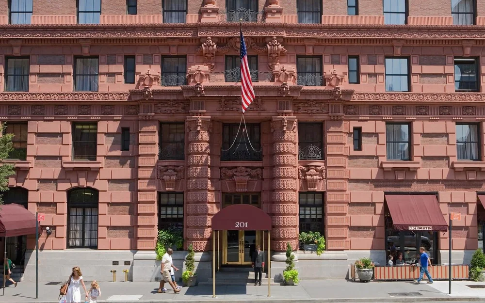
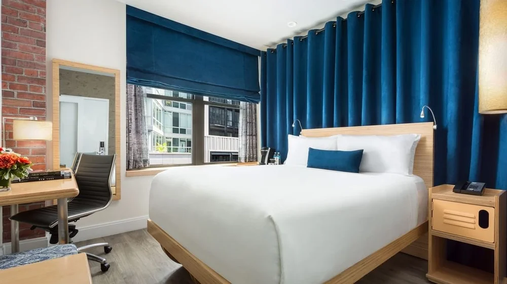

Two hotel blocks are available for attendees, each offering group rates from Tuesday, July 29 through Sunday, August 3.

To receive the discounted rate, reservations must be made by **June 29, 2025**.

## The Lucerne
:::: {.columns}
::: {.column width="40%"}

:::

::: {.column width="3%"}
:::

::: {.column width="57%"}
The Lucerne is one block away from the American Museum of Natural History and is offering King and Queen rooms at a discounted rate.

Book your room at the Lucerne through [this link](https://be.synxis.com/?Hotel=36176&Chain=28484&group=072925AMNH).
:::
::::

## Arthouse Hotel
:::: {.columns}
::: {.column width="40%"}

:::

::: {.column width="3%"}
:::

::: {.column width="57%"}
Arthouse Hotel offers modern rooms just over a block away from the Museum.

Book your room at Arthouse Hotel through [this link](https://nam04.safelinks.protection.outlook.com/?url=https%3A%2F%2Fbe.synxis.com%2F%3Fadult%3D1%26arrive%3D2025-07-29%26chain%3D32673%26child%3D0%26currency%3DUSD%26depart%3D2025-08-03%26group%3D2506AMNHPA%26hotel%3D46829%26level%3Dhotel%26locale%3Den-US%26productcurrency%3DUSD%26rooms%3D1&data=05%7C02%7Cmvilla%40amnh.org%7Cecfb45d50c394226a1b108dd6bc3901e%7Cbe0003e8c6b9496883aeb34586974b76%7C0%7C0%7C638785209880308150%7CUnknown%7CTWFpbGZsb3d8eyJFbXB0eU1hcGkiOnRydWUsIlYiOiIwLjAuMDAwMCIsIlAiOiJXaW4zMiIsIkFOIjoiTWFpbCIsIldUIjoyfQ%3D%3D%7C0%7C%7C%7C&sdata=FQBdXW6xu94ix%2BI3UHKxhSyFNRlOu357SNSOa5%2F2bQA%3D&reserved=0).
:::
::::
