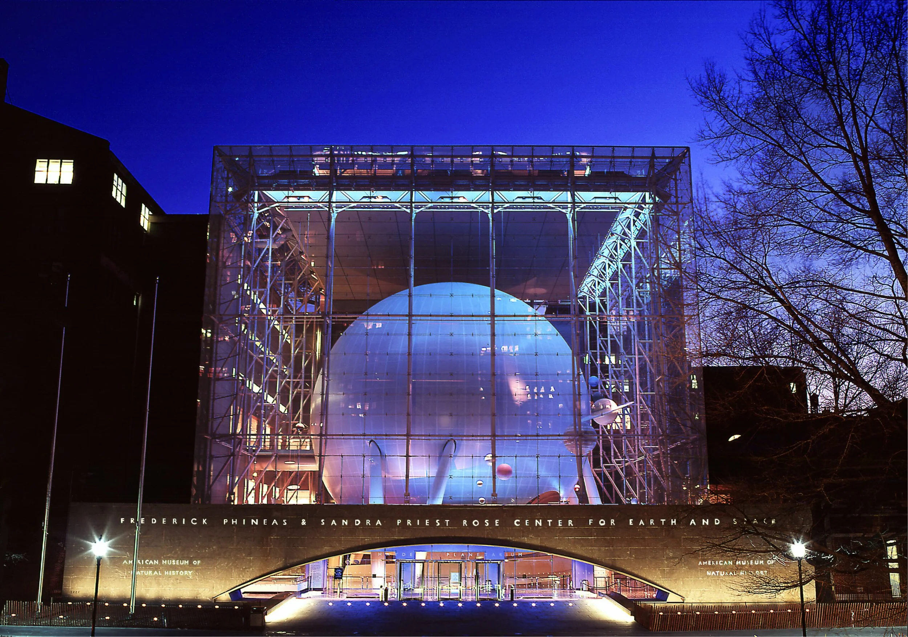

```{=html}
<nav class="dotnav" aria-label="Navigate to section">
  <button class="dotnav__item is-active" data-target="recap" aria-label="Recap"></button>
  <button class="dotnav__item" data-target="sessions" aria-label="Sessions"></button>
  <button class="dotnav__item" data-target="recordings" aria-label="Recordings"></button>
  <button class="dotnav__item" data-target="community" aria-label="Community"></button>
</nav>
```

::: {.content-section #recap}

## A look back

{fig-alt="Hayden Planetarium, American Museum of Natural History, New York"}

Held at the American Museum of Natural History in New York, the 2025 meeting was the first in-person OpenSpace user gathering. Planetarium directors, museum educators, university researchers, and the OpenSpace development team came together for two days of workshops, presentations, and hands-on sessions — with evening events in the Hayden Planetarium and Invisible Worlds Theater.

:::

::: {.content-section #sessions}

## Sessions

The two-day program covered something for every level — from first-time users to advanced developers. Sessions ran in parallel tracks across the Davis Classrooms and Hayden Planetarium.

  - Kickoff: Community, updates & what's ahead — Alex Bock & Megan Villa
  - OpenSpace 101 & custom profiles workshops — Micah Acinapura
  - Lua scripting & content import workshops — Alex Bock
  - ShowComposer, rendered video & configuration files
  - Multi-channel domes: C-Play and C-Troll — Christian Ready, Dylan Salas
  - Portable planetariums — Sarah Treadwell, Josh Roberts
  - Lightning presentations from Carter Emmart, Jackie Faherty, Brian Abbott, KaChun Yu, and more
  - Evening: planetarium shows in the Hayden and Invisible Worlds theaters

:::

::: {.content-section #recordings}

## Session recordings

Recordings from the 2025 sessions are available on YouTube. The full playlist includes workshops, lightning talks, and presentations from both days of the meeting.

[Watch on YouTube](https://www.youtube.com/playlist?list=PLzXWit_1TXstdi_g92k8YIPGaEVG13iJ2){.button__primary}

:::

::: {.content-section #community}

## Community moments

Beyond the formal program, the meeting offered space for the kind of side conversations that move projects forward — in the AMNH planetarium, over coffee, and during informal evening meetups. New collaborations between institutions started here, and several feature requests in the current roadmap trace directly to discussions during the meeting.

:::
