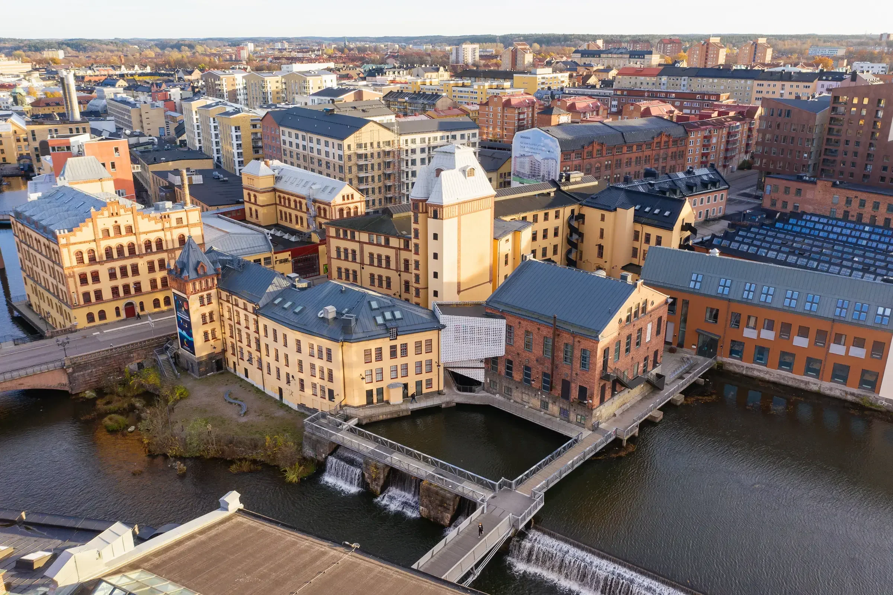

```{=html}
<nav class="dot-nav" aria-label="Navigate to section">
  <button class="dot-nav-item is-active" data-target="about" aria-label="About"></button>
  <button class="dot-nav-item" data-target="venue" aria-label="Venue"></button>
  <button class="dot-nav-item" data-target="schedule" aria-label="Schedule"></button>
  <button class="dot-nav-item" data-target="getting-here" aria-label="Getting here"></button>
  <button class="dot-nav-item" data-target="accommodation" aria-label="Accommodation"></button>
  <button class="dot-nav-item" data-target="register" aria-label="Register"></button>
</nav>
```

::: {.content-section #about}

## Join us in Norrköping

Join us for the second in-person OpenSpace User Meeting in Norrköping, Sweden. OpenSpace users of all levels are invited to the Visualization Center C for three days of trainings, presentations, hands-on sessions, and networking.

This is a great opportunity to:

  - Sharpen your OpenSpace skills
  - Explore the latest software features and updates
  - Connect with educators, planetarium professionals, researchers, and developers in the OpenSpace community

:::

::: {.content-section #venue}

## Visualization Center C

{fig-alt="Visualization Center C, Norrköping, Sweden"}

We're excited to welcome you to the [Visualization Center C](https://visualiseringscenter.se/en/) in Norrköping — a digital science center with a full planetarium, driven in partnership with the Norrköping municipality and Linköping University as a research environment.

Norrköping is an old industrial town located about 90 minutes south of Stockholm. Summer is an amazing time for a visit: during the days of the meeting there will be around 14.5 hours of daylight and only 3.5 hours of true night.


:::

::: {.content-section #schedule}

## Agenda

Schedule is subject to change.

### Wednesday, August 26

| Time                     | Track 1                                                  | Track 2                     | Track 3                            |
| ------------------------ | -------------------------------------------------------- | --------------------------- | ---------------------------------- |
| 09:30 – 10:00<br>(30m)   | Welcome and Kickoff<br>Community, Updates & What's Ahead | ---                         | ---                                |
| 10:00 – 10:30<br>(30m)   | Introductions                                            | ---                         | ---                                |
| 10:30 – 12:30<br>(2h)    | OpenSpace 101 Workshop: Getting Started                  | Coding and Scripting        | Developer Helpdesk/<br>Jam Session |
| 12:30 – 14:00<br>(1h30m) | Lunch on your own                                        | ---                         | ---                                |
| 14:00 – 15:00<br>(1h)    | OpenSpace 201 Workshop: Included Profiles                | Maps and Georeferenced Data | Developer Helpdesk/<br>Jam Session |
| 15:00 – 16:00<br>(1h)    | Coffee Break                                             | ---                         | Developer Helpdesk/<br>Jam Session |
| 16:00 – 18:00<br>(2h)    | OpenSpace 202 Workshop: Included Profiles                | 3D Models and Trajectories  | Developer Helpdesk/<br>Jam Session |
| 18:00 – 19:00<br>(1h)    | Once Upon the Moon<br>Dome movie                         | ---                         | ---                                |
|                          | Dinner on your own                                       |                             |                                    |

### Thursday, August 27


| Time                     | Track 1                                        | Track 2                                      | Track 3                            |
| ------------------------ | ---------------------------------------------- | -------------------------------------------- | ---------------------------------- |
| 09:30 – 11:30<br>(1h30m) | ShowComposer                                   | AssetBuilder                                 | Developer Helpdesk/<br>Jam Session |
| 11:30 – 12:30<br>(1h)    | The Night's Sky                                | OpenSpace on Multichannel Systems            | Developer Helpdesk/<br>Jam Session |
| 12:30 – 14:00<br>(1h30m) | Lunch on your own                              | ---                                          | ---                                |
| 14:00 – 15:00<br>(1h)    | OpenSpace 301 Workshop: Create custom Profiles | Setting up OpenSpace in Display Environments | Developer Helpdesk/<br>Jam Session |
| 15:00 – 16:00<br>(1h)    | Coffee Break                                   | ---                                          | Developer Helpdesk/<br>Jam Session |
| 16:00 – 17:00<br>(1h)    | Creating pre-rendered movies from OpenSpace    | ---                                          | Developer Helpdesk/<br>Jam Session |
| 17:00 – 19:00<br>(2h)    | Dome Show and Tell, Presentation Tips & Tricks | ---                                          | Developer Helpdesk/<br>Jam Session |
|                          | Dinner on your own                             |                                              |                                    |

### Friday, August 28

| Time                     | Track 1                                         | Track 2 | Track 3                            |
| ------------------------ | ----------------------------------------------- | ------- | ---------------------------------- |
| 09:30 – 11:00<br>(1h30m) | Giving Presentations in OpenSpace, a case study | C-Play  | Developer Helpdesk/<br>Jam Session |
| 11:00 – 12:00<br>(1h)    | OpenSpace: Quo vadis?                           | ---     | Developer Helpdesk/<br>Jam Session |
| 12:00 – 12:30<br>(30m)   | Farewell and Thank you                          | ---     | ---                                |
|                          | End of the official program                     |         |                                    |


:::

::: {.content-section #getting-here}

## Travel & airports

Norrköping is easy to reach internationally. Recommended routes:

  - **Stockholm Arlanda (ARN)** — major international hub, roughly 90 minutes to Norrköping by train
  - **Linköping City Airport (LPI)** — direct connections to Amsterdam Schiphol (AMS), one of Europe's main airline hubs

:::

::: {.content-section #accommodation}

## Where to stay

Hotels in the city are around $100 per night. A few options near the venue:

  - [Hotel President](https://ligula.se/en/profilhotels/profilhotels-president/)
  - [Elite Grand Hôtel](https://www.elite.se/en/hotels/norrkoping/elite-grand-hotel-norrkoping/)
  - [Hotel Comfort](https://www.strawberry.se/hotell/sverige/norrkoping/comfort-hotel-norrkoping)

:::


::: {.content-section #register}

## Register for free

Registration is **free**. We recommend bringing your own OpenSpace-compatible laptop, as loaner devices are limited.

Contact [Alexander Bock](mailto:alexander.bock@liu.se) or [Support](mailto:support@openspaceproject.com) with any questions about the meeting.

[Register now](https://visualiseringscenter.se/registration-openspace-user-meeting/){.button__primary}

:::
