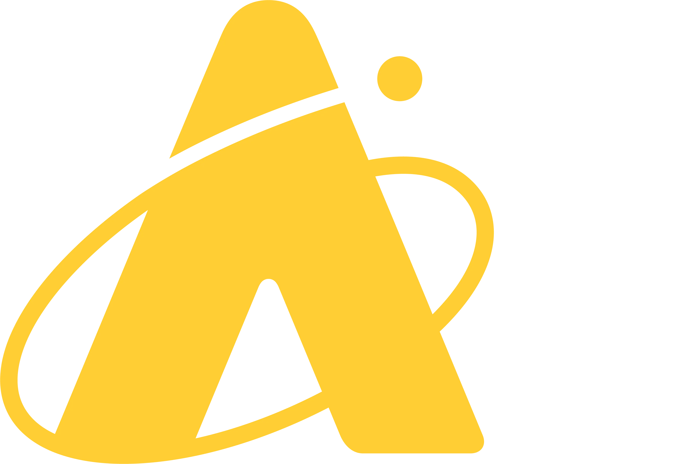
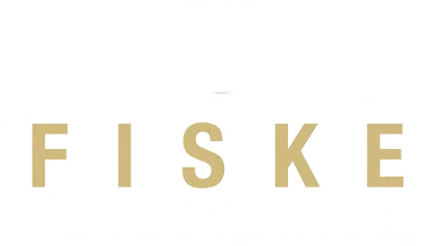
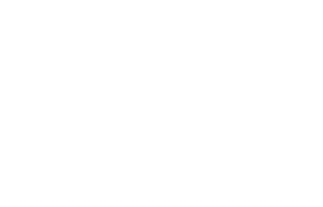
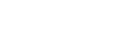
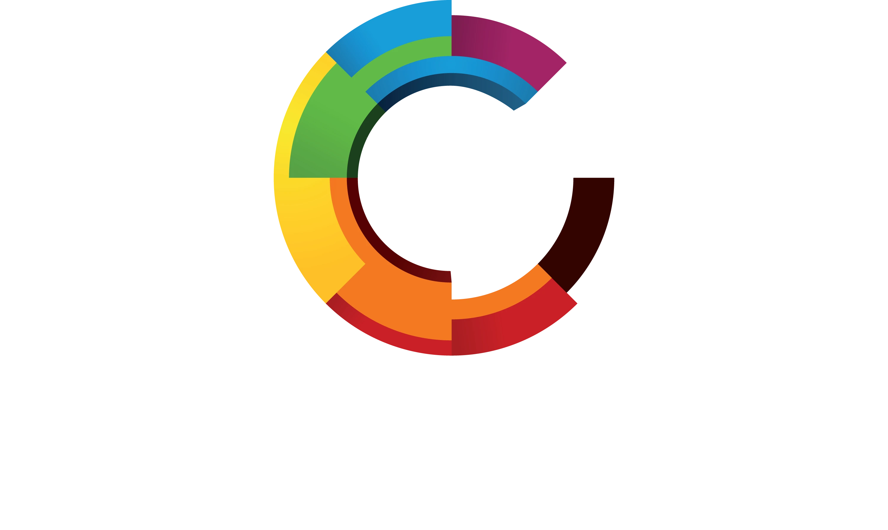
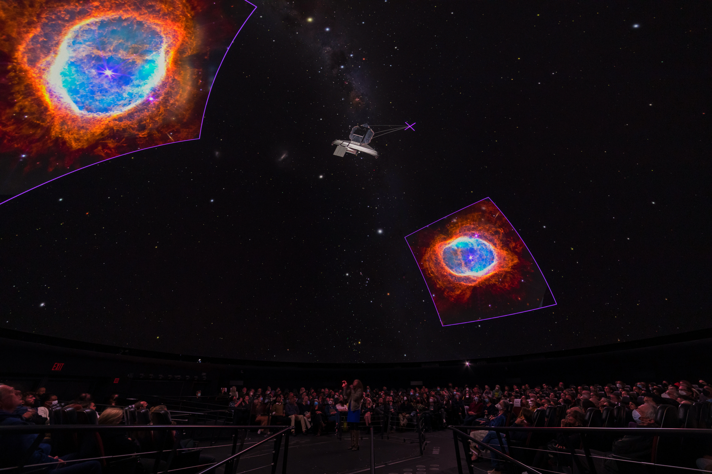
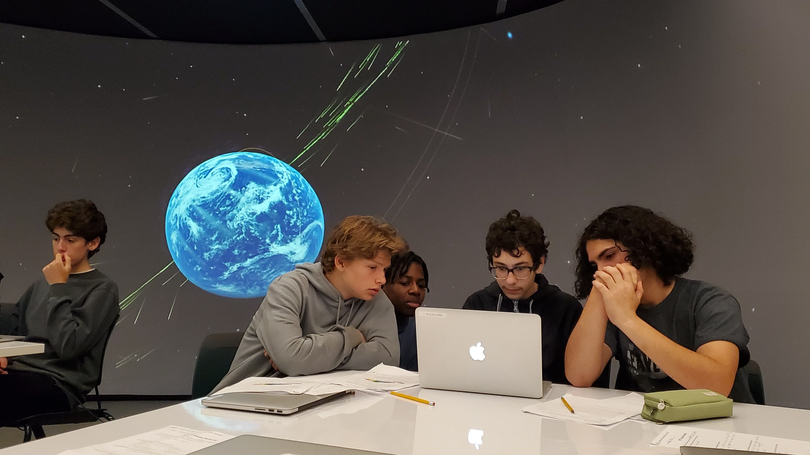
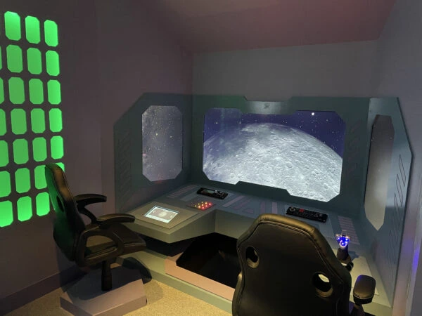
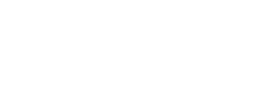
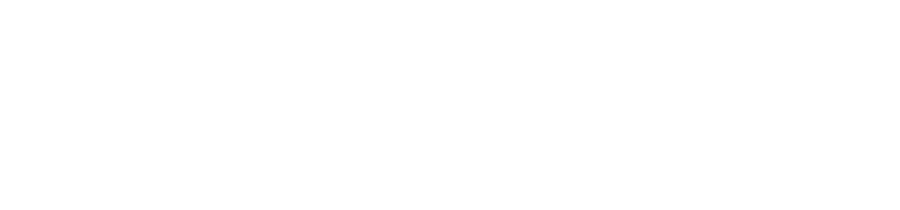

```{=html}
<section class="page-index__hero">
  <div class="page-index__hero-video-wrap">
    <video autoplay muted loop playsinline poster="assets/images/hero_poster.webp">
      <source src="assets/videos/home-zoomout.mp4" type="video/mp4">
      <source src="videos/home-zoomout.webm" type="video/webm">
    </video>
    <div class="page-index__hero-overlay"></div>
  </div>
  <h1>
    <span class="hero-slot">
      <span class="hero-slot__word is-active">Explore</span>
      <span class="hero-slot__word" aria-hidden="true">Research</span>
      <span class="hero-slot__word" aria-hidden="true">Present</span>
      <span class="hero-slot__word" aria-hidden="true">Discover</span>
      <span class="hero-slot__word" aria-hidden="true">Share</span>
      <span class="hero-slot__word" aria-hidden="true">Traverse</span>
      <span class="hero-slot__word" aria-hidden="true">Uncover</span>
      <span class="hero-slot__word" aria-hidden="true">Reveal</span>
      <span class="hero-slot__word" aria-hidden="true">Teach</span>
    </span>
    a Universe of Data
  </h1>
  <div class="page-index__hero-content">
    <p>Open-source software bringing the latest data visualization research to planetariums, classrooms, and screens everywhere.</p>
    <a href="#trusted" class="button__primary page-index__discover-more">
      Discover More
      <iconify-icon icon="lucide:chevron-right" aria-hidden="true"></iconify-icon>
    </a>
  </div>
</section>

<section id="trusted" class="page-index__trusted-section">
  <p class="page-index__trusted-label">Built in collaboration with</p>
  <div class="page-index__logo-grid">
    
    
    
    
    
    
    
    
    
    
  </div>
  <p class="page-index__trusted-more"><a href="about/impact.qmd#orgs">Meet the 100+ organizations running OpenSpace →</a></p>
</section>

<section class="content-section">
  <h2>Built for every venue</h2>
  <p>From a portable screen to a 30-meter planetarium, OpenSpace adapts to your display.</p>
  <div class="page-index__venue-grid">

    <a href="features/display-support.qmd#dome-theaters" class="card">
      <div class="card-media">
        
        <div class="motif dome">
          <svg viewBox="0 0 40 40">
            <path class="arc" d="M5 26 A15 15 0 0 1 35 26"/>
            <line x1="5" y1="26" x2="35" y2="26"/>
          </svg>
        </div>
      </div>
      <div>
        <h3>Planetarium domes</h3>
        <p>Drive fixed and portable domes with multi-projector blending, fisheye, and MPCDI support. Built-in tools for warp, edge-blend, and calibration.</p>
        <span class="learn-more">Learn more <svg viewBox="0 0 16 16" width="16" height="16" fill="none" stroke="currentColor" stroke-width="1.5" stroke-linecap="round" stroke-linejoin="round"><path d="M2 8h11M9 3l5 5-5 5"/></svg></span>
      </div>
    </a>

    <a href="features/display-support.qmd#classrooms-desktops" class="card">
      <div class="card-media">
        
        <div class="motif comet">
          <svg viewBox="0 0 40 40">
            <line class="tail tail1" x1="14" y1="12" x2="2" y2="9"/>
            <line class="tail tail2" x1="14" y1="20" x2="2" y2="20"/>
            <line class="tail tail3" x1="14" y1="28" x2="2" y2="31"/>
            <circle cx="24" cy="20" r="9" fill="none" stroke-width="1.4"/>
          </svg>
        </div>
      </div>
      <div>
        <h3>Classrooms</h3>
        <p>Bring the solar system, deep space, and live mission data into any classroom. Free, cross-platform, with curated profiles and lesson-ready content.</p>
        <span class="learn-more">Learn more <svg viewBox="0 0 16 16" width="16" height="16" fill="none" stroke="currentColor" stroke-width="1.5" stroke-linecap="round" stroke-linejoin="round"><path d="M2 8h11M9 3l5 5-5 5"/></svg></span>
      </div>
    </a>

    <a href="features/display-support.qmd#museum-exhibits" class="card">
      <div class="card-media">
        
        <div class="motif planet">
          <svg viewBox="0 0 40 40">
            <circle cx="20" cy="20" r="8"/>
            <ellipse class="ring-ellipse" cx="20" cy="18" rx="12" ry="3.5" transform="rotate(-20 20 18)"/>
          </svg>
        </div>
      </div>
      <div>
        <h3>Museum exhibits</h3>
        <p>Power immersive shows and traveling exhibits. Touch interfaces, custom profiles, and synchronized multi-screen displays.</p>
        <span class="learn-more">Learn more <svg viewBox="0 0 16 16" width="16" height="16" fill="none" stroke="currentColor" stroke-width="1.5" stroke-linecap="round" stroke-linejoin="round"><path d="M2 8h11M9 3l5 5-5 5"/></svg></span>
      </div>
    </a>

  </div>
</section>


<section class="content-section">
  <h2>See what's possible</h2>
  <p>Scientifically accurate visualizations from real data — planetary surfaces, mission trajectories, deep-sky catalogs, and live space weather.</p>
```

::: {#carousel}
:::

```{=html}
</section>


<section class="content-section">
  <h2>Funded by</h2>
  <p class="text-center">OpenSpace is grateful to be supported by the following public research funders.</p>

  <div class="page-index__funder-marquee">
    <div class="page-index__funder-track">
      <a href="https://www.nasa.gov" target="_blank" rel="noopener noreferrer"></a>
      <a href="https://kaw.wallenberg.org" target="_blank" rel="noopener noreferrer"></a>
      <a href="https://e-science.se/" target="_blank" rel="noopener noreferrer"></a>
      <a href="https://www.vr.se/english" target="_blank" rel="noopener noreferrer"></a>
      <a href="https://www.rymdstyrelsen.se/en/" target="_blank" rel="noopener noreferrer"></a>

      <a href="https://www.nasa.gov" target="_blank" rel="noopener noreferrer"></a>
      <a href="https://kaw.wallenberg.org" target="_blank" rel="noopener noreferrer"></a>
      <a href="https://e-science.se/" target="_blank" rel="noopener noreferrer"></a>
      <a href="https://www.vr.se/english" target="_blank" rel="noopener noreferrer"></a>
      <a href="https://www.rymdstyrelsen.se/en/" target="_blank" rel="noopener noreferrer"></a>
    </div>
  </div>

  <p class="page-index__funder-disclaimer">Funded in part by NASA under award No NNX16AB93A. Any opinions, findings, and conclusions or recommendations expressed in this material are those of the authors and do not necessarily reflect the views of NASA.</p>
</section>
```

