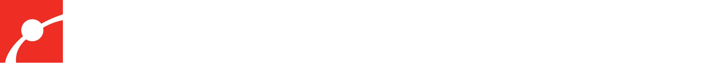
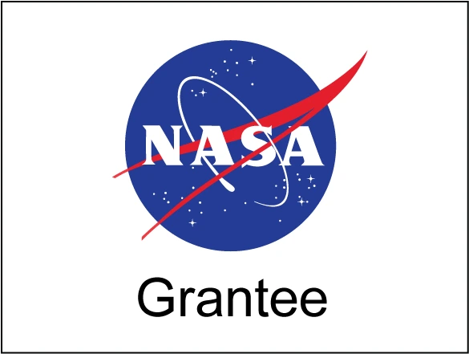

```{=html}
<section class="hero-section">
  <div class="hero-video-wrap">
    <video autoplay muted loop playsinline poster="images/hero-poster.jpg" class="hero-video">
      <source src="assets/videos/home-zoomout.mp4" type="video/mp4">
      <source src="videos/home-zoomout.webm" type="video/webm">
    </video>
    <div class="hero-overlay"></div>
  </div>
  <h1 class="hero-title">Explore a Universe of Data</h1>
  <div class="hero-content">
    <p class="hero-lede">Open-source software bringing the latest data visualization research to planetariums, classrooms, and screens everywhere.</p>
    <div class="hero-actions">
      <a href="install/version-0213.qmd" class="btn-primary-os">Download OpenSpace</a>
      <a href="features.html" class="btn-ghost-os">Explore features</a>
    </div>
  </div>
</section>

<section class="trusted-section">
  <div class="os-container">
    <p class="trusted-label">Trusted by 100+ institutions worldwide</p>
    <div class="logo-grid">
      
      
      
      
      
      
      
      
      
      

    </div>
  </div>
</section>

<section class="venues-section">
  <div class="os-container">
    <h2 class="section-heading">Built for every venue</h2>
    <p class="section-lede">From a portable inflatable dome to a 30-meter planetarium, OpenSpace adapts to your display.</p>
    <div class="venue-grid">

      <a href="features/display-support.html#dome-theaters" class="venue-card">
        
        <div class="venue-body">
          <h3>Planetarium domes</h3>
          <p>Drive fixed and portable domes with multi-projector blending, fisheye, and MPCDI support. Built-in tools for warp, edge-blend, and calibration.</p>
          <span class="venue-link">Learn more →</span>
        </div>
      </a>

      <a href="features/display-support.html#classrooms-desktops" class="venue-card">
        
        <div class="venue-body">
          <h3>Classrooms</h3>
          <p>Bring the solar system, deep space, and live mission data into any classroom. Free, cross-platform, with curated profiles and lesson-ready content.</p>
          <span class="venue-link">Learn more →</span>
        </div>
      </a>

      <a href="features/display-support.html#museum-exhibits" class="venue-card">
        
        <div class="venue-body">
          <h3>Museum exhibits</h3>
          <p>Power immersive permanent and traveling exhibits. Touch interfaces, custom profiles, and synchronized multi-screen displays.</p>
          <span class="venue-link">Learn more →</span>
        </div>
      </a>

    </div>
  </div>
</section>

<section class="content-carousel-section">
  <div class="os-container">
    <h2 class="section-heading">See what's possible</h2>
    <p class="section-lede">Real visualizations from real data &mdash; planetary surfaces, mission trajectories, deep-sky catalogs, and live space weather.</p>
  </div>

  <div class="content-carousel" id="contentCarousel">
    <div class="content-carousel-track" id="carouselTrack">

      <div class="content-slide" style="background-image: url('assets/images/carousel/mars-surface.webp');">
        <div class="content-slide-overlay"></div>
        <div class="content-slide-text">
          <p class="content-slide-eyebrow">Globe Browsing</p>
          <h3 class="content-slide-title">Mars surface from HiRISE imagery</h3>
        </div>
      </div>

      <div class="content-slide" style="background-image: url('images/showcase/asteroid-trajectories.jpg');">
        <div class="content-slide-overlay"></div>
        <div class="content-slide-text">
          <p class="content-slide-eyebrow">Mission visualizations</p>
          <h3 class="content-slide-title">Asteroid trajectories near Earth</h3>
        </div>
      </div>

      <div class="content-slide" style="background-image: url('images/showcase/galaxy-cluster.jpg');">
        <div class="content-slide-overlay"></div>
        <div class="content-slide-text">
          <p class="content-slide-eyebrow">Digital Universe</p>
          <h3 class="content-slide-title">Galaxy cluster catalog</h3>
        </div>
      </div>

      <div class="content-slide" style="background-image: url('images/showcase/space-weather.jpg');">
        <div class="content-slide-overlay"></div>
        <div class="content-slide-text">
          <p class="content-slide-eyebrow">Space weather</p>
          <h3 class="content-slide-title">Solar wind and magnetosphere</h3>
        </div>
      </div>

      <div class="content-slide" style="background-image: url('images/showcase/jwst-orbit.jpg');">
        <div class="content-slide-overlay"></div>
        <div class="content-slide-text">
          <p class="content-slide-eyebrow">Mission visualizations</p>
          <h3 class="content-slide-title">JWST at Lagrange Point 2</h3>
        </div>
      </div>

    </div>
  </div>

  <div class="carousel-controls">
    <div class="carousel-dots" id="carouselDots"></div>
    <div class="carousel-buttons">
      <button class="carousel-btn" id="carouselPrev" aria-label="Previous slide">&#8249;</button>
      <button class="carousel-btn" id="carouselNext" aria-label="Next slide">&#8250;</button>
    </div>
  </div>
</section>

<script>
(function() {
  const track = document.getElementById('carouselTrack');
  const dotsContainer = document.getElementById('carouselDots');
  const prevBtn = document.getElementById('carouselPrev');
  const nextBtn = document.getElementById('carouselNext');
  if (!track) return;

  const slides = track.querySelectorAll('.content-slide');
  const total = slides.length;
  let current = 0;

  for (let i = 0; i < total; i++) {
    const dot = document.createElement('button');
    dot.className = 'carousel-dot' + (i === 0 ? ' active' : '');
    dot.setAttribute('aria-label', 'Go to slide ' + (i + 1));
    dot.addEventListener('click', () => goTo(i));
    dotsContainer.appendChild(dot);
  }

  function goTo(index) {
    current = Math.max(0, Math.min(index, total - 1));
    const slide = slides[0];
    const slideWidth = slide.offsetWidth + 14;
    track.style.transform = 'translateX(-' + (current * slideWidth) + 'px)';
    dotsContainer.querySelectorAll('.carousel-dot').forEach((d, i) => {
      d.classList.toggle('active', i === current);
    });
    prevBtn.disabled = current === 0;
    nextBtn.disabled = current === total - 1;
  }

  prevBtn.addEventListener('click', () => goTo(current - 1));
  nextBtn.addEventListener('click', () => goTo(current + 1));
  goTo(0);
})();
</script>

<section class="funders-section">
  <h2 class="section-heading text-center">Funded by</h2>
  <p class="section-lede text-center">OpenSpace is non-commercial software supported by a coalition of public research funders.</p>

  <div class="funder-marquee">
    <div class="funder-track">
      <a href="https://www.nasa.gov" target="_blank" rel="noopener noreferrer"></a>
      <a href="https://kaw.wallenberg.org" target="_blank" rel="noopener noreferrer"></a>
      <a href="https://e-science.se/" target="_blank" rel="noopener noreferrer"></a>
      <a href="https://www.esero.se/in-english/" target="_blank" rel="noopener noreferrer"></a>
      <a href="https://www.vr.se/english" target="_blank" rel="noopener noreferrer"></a>
      <a href="https://www.rymdstyrelsen.se/en/" target="_blank" rel="noopener noreferrer"></a>

      <a href="https://www.nasa.gov" target="_blank" rel="noopener noreferrer"></a>
      <a href="https://kaw.wallenberg.org" target="_blank" rel="noopener noreferrer"></a>
      <a href="https://e-science.se/" target="_blank" rel="noopener noreferrer"></a>
      <a href="https://www.esero.se/in-english/" target="_blank" rel="noopener noreferrer"></a>
      <a href="https://www.vr.se/english" target="_blank" rel="noopener noreferrer"></a>
      <a href="https://www.rymdstyrelsen.se/en/" target="_blank" rel="noopener noreferrer"></a>
    </div>
  </div>

  <p class="funder-disclaimer">Funded in part by NASA under award No NNX16AB93A. Any opinions, findings, and conclusions or recommendations expressed in this material are those of the authors and do not necessarily reflect the views of NASA.</p>
</section>

<section class="cta-section">
  <div class="cta-card">
    <h2 class="section-heading">Start exploring</h2>
    <p class="section-lede">Free. Open source. Cross-platform.</p>
    <div class="hero-actions">
      <a href="install/version-0213.qmd" class="btn-primary-os">Download OpenSpace</a>
      <a href="https://github.com/OpenSpace/OpenSpace" class="btn-ghost-os">View on GitHub</a>
    </div>
  </div>
</section>

```
